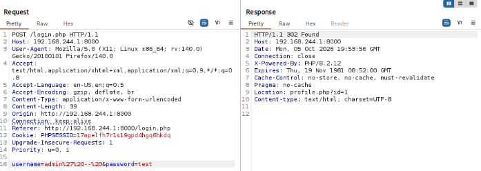
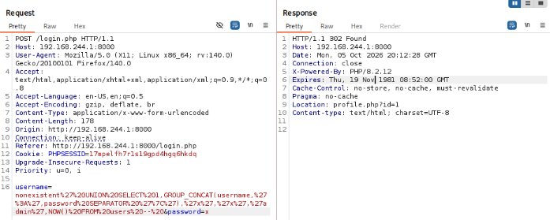
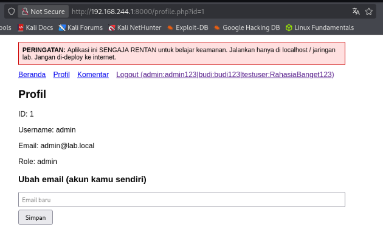

# Vulnerability #1: SQL Injection

## 1. Overview

| Field | Value |
|---|---|
| Location | login.php, register.php, profile.php, comments.php |
| OWASP Top 10 (2021) | A03:2021 - Injection |
| CWE Reference | CWE-89 (SQL Injection) |
| Severity | Critical |

## 2. Description

User-supplied input (username, password, email, comment content, and the profile "id" parameter) is concatenated directly into SQL query strings instead of being passed through parameterized queries. This allows an attacker to alter the structure and logic of the query, bypass authentication, extract arbitrary data from the database, or inject additional SQL commands.

## 3. Vulnerable Code

*vulnerable/login.php (excerpt)*

```php
$username = $_POST['username'];
$password = $_POST['password'];

// Vulnerable: user input concatenated directly into the query
$sql = "SELECT * FROM users WHERE username='$username' AND password='$password'";
$result = mysqli_query($conn, $sql);
```

## 4. Exploitation Steps

1. Open the login form and submit the payload admin' -- (with a trailing space) in the username field, leaving the password field with any value.
2. The resulting query becomes: SELECT * FROM users WHERE username='admin' --  AND password='...' — everything after -- is treated as a SQL comment, so the password check is skipped entirely and the attacker is logged in as admin without knowing the password.
3. To go further, a UNION-based payload was used in the username field: nonexistent' UNION SELECT 1,GROUP_CONCAT(username,':',password SEPARATOR '|'),'x','x','admin',NOW() FROM users -- 
4. This payload forces the query to return a forged row containing every username and password in the users table, concatenated into a single string, in the position normally occupied by the real "username" column.
5. Because login.php reads the first result row and uses it to build the session, the attacker is logged in with the forged "admin" role and is redirected to profile.php, which then displays the concatenated string — i.e. the full contents of the users table — as if it were a normal username field.
6. All requests were crafted and sent via Burp Suite Repeater, intercepting traffic from Kali Linux to the Windows-hosted PHP application.

## 5. Evidence (Screenshots)



*Burp Repeater request showing the admin' --  payload in the username field*


*Burp Repeater response: HTTP 302 Found with Location: profile.php?id=1 (successful bypass)*



*Burp Repeater request showing the UNION SELECT + GROUP_CONCAT payload*



*profile.php rendered in the browser, showing the extracted username:password pairs for all accounts*

## 6. Secure Code (Fix)

*secure/login.php (excerpt)*

```php
// Fixed: prepared statement, user input is never part of the SQL string
$stmt = $conn->prepare('SELECT id, username, password, role FROM users WHERE username = ?');
$stmt->bind_param('s', $username);
$stmt->execute();
$result = $stmt->get_result();
$row = $result->fetch_assoc();
$stmt->close();

if ($row && password_verify($password, $row['password'])) {
    // proceed with login
}
```

## 7. Retest Results

- The payload admin' --  was re-submitted against secure/login.php. The quote character is treated as literal data by the prepared statement, so no user named admin' --  exists and the login correctly fails.
- The UNION SELECT payload was re-submitted. Because the entire input is bound as a single string parameter rather than being parsed as SQL, the query only ever searches for a username literally equal to the whole payload string, and no injection occurs.
- All other endpoints (register.php, profile.php, comments.php) were likewise verified to use prepared statements; manual injection attempts against the email, comment, and profile-update fields returned no anomalous behavior.

## 8. Lessons Learned

Never build SQL queries by concatenating user input into a string, regardless of how the input is validated on the client side. Prepared statements with bound parameters are the standard, reliable mitigation: they ensure user input is always treated as data, never as part of the query's logic, even when the input contains SQL metacharacters.
