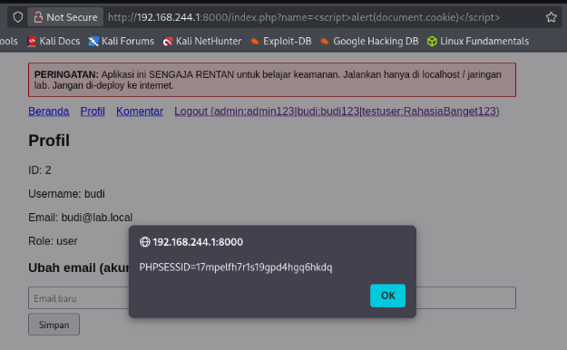
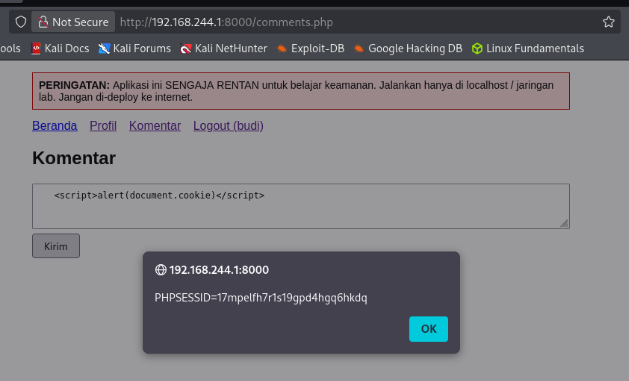
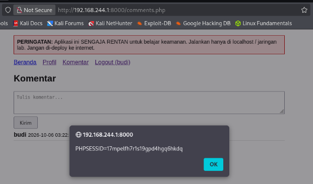

# Vulnerability #3: Cross-Site Scripting (Reflected & Stored)

## 1. Overview

| Field | Value |
|---|---|
| Location | index.php (?name= parameter), comments.php, profile.php |
| OWASP Top 10 (2021) | A03:2021 - Injection |
| CWE Reference | CWE-79 (Improper Neutralization of Input During Web Page Generation) |
| Severity | High |

## 2. Description

User-controlled data is written directly into HTML output without escaping. Two variants were demonstrated: reflected XSS, where a malicious script is embedded in a URL parameter and executes immediately when the victim opens the link; and stored XSS, where a malicious script is saved to the database (via the comments feature) and executes automatically for every user who later views the affected page, including an administrator.

## 3. Vulnerable Code

*vulnerable/index.php and vulnerable/comments.php (excerpts)*

```php
// index.php - reflected XSS
if (isset($_GET['name'])) {
    echo "<p>Halo, " . $_GET['name'] . "!</p>";
}

// comments.php - stored XSS
$content = $_POST['content'];
mysqli_query($conn, "INSERT INTO comments (user_id, content) VALUES (" .
    $_SESSION['user_id'] . ", '$content')");
...
echo $row['content'];   // printed without escaping
```

## 4. Exploitation Steps

1. Reflected XSS: the URL index.php?name=<script>alert(document.cookie)</script> was opened in the browser. The script executed immediately, popping an alert box containing the current PHPSESSID session cookie value.
2. Stored XSS: while logged in, the payload <script>alert(document.cookie)</script> was submitted through the comment form on comments.php.
3. After submitting (using a fresh GET request to avoid Firefox's form resubmission warning), the comment page was reloaded. The alert fired again automatically, without the payload being re-typed — confirming the script was persisted in the database and will execute for any visitor who views the comments page, including an administrator.

## 5. Evidence (Screenshots)


*Browser address bar showing the index.php?name=<script>... payload URL*



*Alert dialog box displaying document.cookie (PHPSESSID value) from the reflected XSS*



*Comment form with the <script> payload entered*



*Comments page reloaded via GET, showing the alert firing automatically (stored XSS)*

## 6. Secure Code (Fix)

*secure/index.php and secure/comments.php (excerpts)*

```php
// index.php - escape output before printing
if (isset($_GET['name'])) {
    $name = htmlspecialchars($_GET['name'], ENT_QUOTES, 'UTF-8');
    echo "<p>Halo, {$name}!</p>";
}

// comments.php - escape every field derived from user input
echo htmlspecialchars($row['username'], ENT_QUOTES, 'UTF-8');
echo nl2br(htmlspecialchars($row['content'], ENT_QUOTES, 'UTF-8'));
```

## 7. Retest Results

- The reflected payload index.php?name=<script>alert(1)</script> was re-submitted. No alert box appeared; viewing the page source confirmed the tag was rendered as literal text (&lt;script&gt;...&lt;/script&gt;) rather than executed.
- The same payload was re-submitted through the comment form. After reload, the comment displayed the literal text of the script tag instead of executing it.

## 8. Lessons Learned

Any data that originates from the user — including data that has been stored in and retrieved from the database — must be HTML-escaped at the point it is written into a page, using htmlspecialchars() with ENT_QUOTES. Escaping must happen on every output point, not just once at input time, since the same stored value may later be rendered in multiple contexts.
