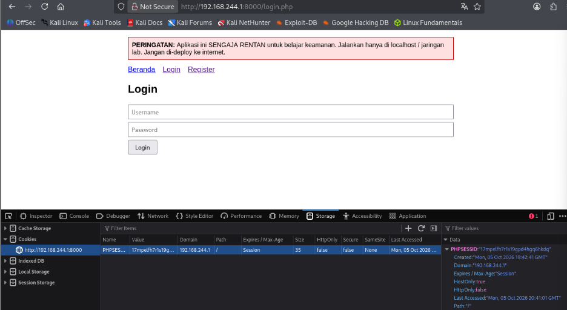
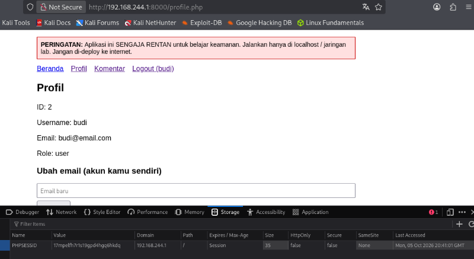

# Vulnerability #4: Weak Session Management (Session Fixation & Insecure Cookies)

## 1. Overview

| Field | Value |
|---|---|
| Location | config.php, login.php, logout.php |
| OWASP Top 10 (2021) | A07:2021 - Identification and Authentication Failures |
| CWE Reference | CWE-384 (Session Fixation), CWE-613 (Insufficient Session Expiration) |
| Severity | High |

## 2. Description

The application never regenerates the session identifier after a successful login, and the session cookie is issued without HttpOnly or SameSite protections. logout.php only clears individual session variables rather than destroying the session and its cookie. Together, these issues allow an attacker who can set or predict a victim's session ID before login to reuse that same session ID after the victim authenticates ("session fixation"), and leave sessions reachable to client-side scripts and longer-lived than necessary.

## 3. Vulnerable Code

*vulnerable/config.php and vulnerable/logout.php (excerpts)*

```php
// config.php
session_start(); // no cookie security options, no regeneration on login

// login.php - after a successful match, the session ID is never regenerated
$_SESSION['user_id']  = $row['id'];
$_SESSION['username'] = $row['username'];
$_SESSION['role']     = $row['role'];

// logout.php
unset($_SESSION['user_id'], $_SESSION['username'], $_SESSION['role']);
// no session_destroy(), no cookie removal
```

## 4. Exploitation Steps

1. Before logging in, the value of the PHPSESSID cookie was recorded from a GET request to login.php (via browser dev tools / Burp).
2. A normal login was performed with valid credentials (budi / budi123).
3. After the redirect to the profile page, the PHPSESSID cookie value was checked again.
4. The value was found to be identical before and after login, confirming that the application does not rotate the session identifier when a user's privilege level changes from anonymous to authenticated.

## 5. Evidence (Screenshots)



*Browser/Burp view of PHPSESSID before login*



*Browser/Burp view of PHPSESSID after successful login, showing the identical value*

## 6. Secure Code (Fix)

*secure/config.php and secure/login.php (excerpts)*

```php
// config.php - secure cookie parameters set before session_start()
session_set_cookie_params([
    'lifetime' => 0,
    'path'     => '/',
    'httponly' => true,
    'samesite' => 'Lax',
]);
session_start();

// login.php - regenerate the session ID immediately after authentication
session_regenerate_id(true);
$_SESSION['user_id']  = $row['id'];
$_SESSION['username'] = $row['username'];
$_SESSION['role']     = $row['role'];

// logout.php - fully destroy the session and its cookie
$_SESSION = [];
setcookie(session_name(), '', time() - 42000, $params['path'], ...);
session_destroy();
```

## 7. Retest Results

- The PHPSESSID value was recorded before login, a login was performed, and the value was checked again on secure/login.php.
- The session ID was found to be different after login, confirming session_regenerate_id(true) is effective against fixation.
- After calling logout.php, the session cookie was observed to be cleared and the previous session data was no longer accessible.

## 8. Lessons Learned

Always call session_regenerate_id(true) immediately after a successful authentication event, so any session identifier an attacker may have set beforehand becomes useless. Session cookies should also be marked HttpOnly and SameSite, and logout should fully destroy the session rather than only clearing select variables.
