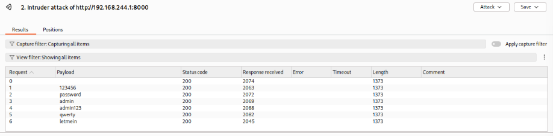

# Vulnerability #5: No Brute-Force Protection

## 1. Overview

| Field | Value |
|---|---|
| Location | login.php |
| OWASP Top 10 (2021) | A07:2021 - Identification and Authentication Failures |
| CWE Reference | CWE-307 (Improper Restriction of Excessive Authentication Attempts) |
| Severity | High |

## 2. Description

The login endpoint accepts an unlimited number of authentication attempts with no delay, lockout, or CAPTCHA, making it practical for an attacker to automate password guessing against any known username, including the administrator account.

## 3. Vulnerable Code

*vulnerable/login.php (excerpt)*

```php
if ($_SERVER['REQUEST_METHOD'] === 'POST') {
    // ... query executed on every request ...
    // no attempt counter, no delay, no lockout of any kind
}
```

## 4. Exploitation Steps

1. A failed login request was captured in Burp Suite and sent to Intruder.
2. The password parameter was marked as the injection position, and a wordlist of common passwords was configured as the payload set.
3. The attack was launched. Every request returned promptly with no increasing delay and no lockout response, demonstrating that an unlimited number of password guesses can be attempted automatically.

## 5. Evidence (Screenshots)



*Burp Intruder attack results table, showing multiple consecutive login attempts all processed with HTTP 200 responses and no lockout or delay*

## 6. Secure Code (Fix)

*secure/login.php (excerpt)*

```php
const MAX_ATTEMPTS   = 5;
const LOCKOUT_WINDOW = 300; // 5 minutes

// Count recent failed attempts for this username
$stmt = $conn->prepare(
    'SELECT COUNT(*) AS jumlah FROM login_attempts
     WHERE username = ? AND attempted_at > (NOW() - INTERVAL ? SECOND)'
);
$stmt->bind_param('si', $username, $lockoutWindow);
...
if ($jumlahGagal >= MAX_ATTEMPTS) {
    $message = 'Too many failed attempts. Please try again in a few minutes.';
} else {
    // proceed with the normal login check, and log a failed attempt on mismatch
}
```

## 7. Retest Results

- The same username was used to submit five consecutive incorrect passwords through the login form.
- On the sixth attempt, the application responded with the lockout message instead of processing the credentials check, confirming the rate limit is enforced.
- As an additional finding, a Burp Intruder attack against secure/login.php was blocked entirely by the CSRF protection (Vulnerability #6) before it could reach the lockout logic, since Intruder did not supply a valid, session-bound CSRF token on each request — every request returned HTTP 403. This shows the CSRF fix provides defense-in-depth against automated brute-force tooling as well.

## 8. Lessons Learned

Authentication endpoints must track failed attempts and enforce a lockout or increasing delay once a threshold is reached. A simple attempts table keyed by username, checked against a rolling time window, is sufficient for most applications and requires no external dependency. Combining this with CSRF protection and tokens further raises the cost of automated attacks.
