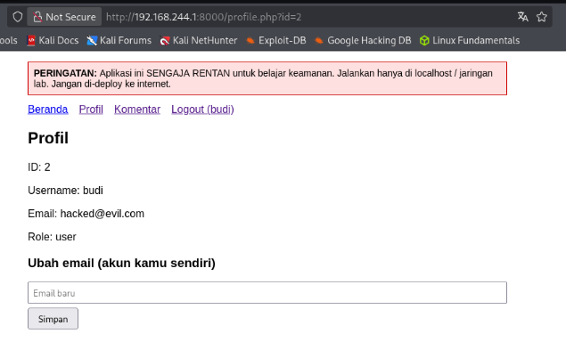

# Vulnerability #6: Cross-Site Request Forgery (CSRF)

## 1. Overview

| Field | Value |
|---|---|
| Location | profile.php (email update), comments.php |
| OWASP Top 10 (2021) | A01:2021 - Broken Access Control |
| CWE Reference | CWE-352 (Cross-Site Request Forgery) |
| Severity | High |

## 2. Description

State-changing POST requests (updating a user's email address, posting a comment) are accepted with no verification that the request originated from the application's own form. This allows a malicious third-party web page to submit a forged request using the victim's active session cookie, without the victim's knowledge or consent, as long as the victim's browser has an authenticated session open.

## 3. Vulnerable Code

*vulnerable/profile.php (excerpt)*

```php
// No CSRF token is requested or checked anywhere in this form handler
if ($_SERVER['REQUEST_METHOD'] === 'POST' && isset($_POST['email'])) {
    $email = $_POST['email'];
    mysqli_query($conn, "UPDATE users SET email='$email' WHERE id=" . $_SESSION['user_id']);
    $message = 'Email diperbarui.';
}
```

## 4. Exploitation Steps

1. While logged in as budi in the browser (session active, cookie present), a separate HTML file (csrf-poc.html) was created outside the application, containing a form that auto-submits to profile.php with a hidden email field set to hacked@evil.com.
2. The malicious HTML file was opened in the same browser/tab where the victim session was active, simulating a victim clicking a link to an attacker-controlled page.
3. The form submitted automatically via its onload handler. The browser included the victim's session cookie automatically, as it does for any request to the target domain.
4. The profile page was reloaded, and the account's email address was confirmed to have changed permanently to hacked@evil.com — a change the victim never intentionally made.

## 5. Evidence (Screenshots)



*profile.php showing the account email changed to hacked@evil.com after the forged cross-site request was submitted, while still logged in as budi*

## 6. Secure Code (Fix)

*secure/config.php and secure/profile.php (excerpts)*

```php
// config.php
function csrf_token(): string {
    if (empty($_SESSION['csrf_token'])) {
        $_SESSION['csrf_token'] = bin2hex(random_bytes(32));
    }
    return $_SESSION['csrf_token'];
}
function csrf_verify(): bool {
    return isset($_POST['csrf_token'], $_SESSION['csrf_token'])
        && hash_equals($_SESSION['csrf_token'], $_POST['csrf_token']);
}

// profile.php
if ($_SERVER['REQUEST_METHOD'] === 'POST' && isset($_POST['email'])) {
    if (!csrf_verify()) {
        http_response_code(403);
        die('Request rejected: invalid security token.');
    }
    // ... proceed with the update ...
}
```

## 7. Retest Results

- The same csrf-poc.html page was opened again against secure/profile.php while logged in as budi.
- The request was rejected with an HTTP 403 response and the message "Request rejected: invalid security token", because the forged form could not supply a csrf_token value matching the one stored in the victim's session.
- The profile page was reloaded and the email address was confirmed to remain unchanged.

## 8. Lessons Learned

Every state-changing form must include a per-session, unpredictable CSRF token that is verified on submission using a timing-safe comparison (hash_equals). This ensures that only requests originating from the application's own pages — which can read the token — are accepted, defeating forged cross-site requests even when the victim's session cookie is valid.
