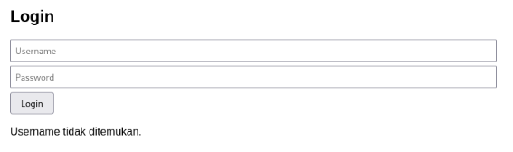
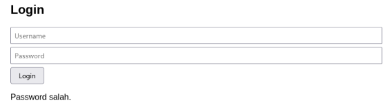
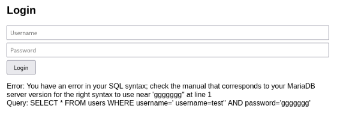

# Vulnerability #7: User Enumeration & Verbose Error Messages

## 1. Overview

| Field | Value |
|---|---|
| Location | login.php, register.php |
| OWASP Top 10 (2021) | A07:2021 / A05:2021 - Identification and Authentication Failures / Security Misconfiguration |
| CWE Reference | CWE-204 (Observable Response Discrepancy), CWE-209 (Generation of Error Message Containing Sensitive Information) |
| Severity | Medium |

## 2. Description

The login form returns a different, specific message depending on whether the submitted username exists ("Password salah.") or does not exist ("Username tidak ditemukan."), allowing an attacker to enumerate valid usernames without knowing any password. Separately, raw database error messages — including the exact failing SQL query — are displayed directly to the user whenever a query fails, disclosing the database engine, table structure, and query logic.

## 3. Vulnerable Code

*vulnerable/login.php (excerpt)*

```php
if (!$result) {
    $message = 'Error: ' . mysqli_error($conn) . '<br>Query: ' . $sql;
} elseif (mysqli_num_rows($result) > 0) {
    // ... login success ...
} else {
    $cek = mysqli_query($conn, "SELECT id FROM users WHERE username='$username'");
    if ($cek && mysqli_num_rows($cek) > 0) {
        $message = 'Password salah.';
    } else {
        $message = 'Username tidak ditemukan.';
    }
}
```

## 4. Exploitation Steps

1. A login attempt was made with a username known not to exist (usernamengasal123) and an arbitrary password. The application responded with "Username tidak ditemukan."
2. A login attempt was made with a valid username (admin) and a deliberately incorrect password. The application responded with the different message "Password salah." — confirming that usernames can be enumerated purely from the response message.
3. A login attempt was made with a single quote character in the username field (test'), which broke the SQL syntax. The application displayed the raw MariaDB error message along with the complete SQL query text, confirming both the database engine in use and the exact structure of the query being executed.

## 5. Evidence (Screenshots)



*Response for a non-existent username: "Username tidak ditemukan."*



*Response for a valid username with a wrong password: "Password salah."*



*Raw SQL error message disclosed to the user, including the MariaDB syntax error and the full query text*

## 6. Secure Code (Fix)

*secure/login.php and secure/config.php (excerpts)*

```php
// login.php - a single, generic message regardless of the failure reason
if ($row && password_verify($password, $row['password'])) {
    // success
} else {
    $message = 'Username atau password salah.';
}

// config.php - database errors are logged server-side, never shown to the user
try {
    $conn = mysqli_connect(...);
} catch (mysqli_sql_exception $e) {
    error_log('DB connection error: ' . $e->getMessage());
    http_response_code(500);
    die('Terjadi kesalahan pada server. Coba lagi nanti.');
}
```

## 7. Retest Results

- A login attempt with a non-existent username and a login attempt with a valid username and wrong password were both repeated against secure/login.php.
- Both cases returned the identical message, "Username atau password salah.", confirming that username enumeration via response message differences is no longer possible.
- A single-quote character was submitted in the username field. Because the field is now bound as a parameter in a prepared statement rather than concatenated into SQL, no syntax error occurred and no query text was ever exposed to the user.

## 8. Lessons Learned

Authentication failure messages must be identical regardless of whether the username or the password was incorrect, to prevent trivial account enumeration. Application errors — especially database errors — should never be displayed to end users; they should be logged server-side (e.g. with error_log()) and replaced with a generic, non-technical message in the response.
