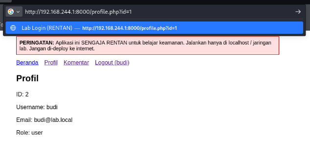
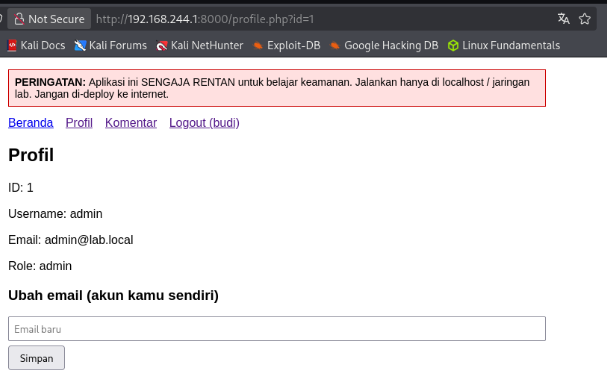

# Vulnerability #8: Insecure Direct Object Reference (IDOR)

## 1. Overview

| Field | Value |
|---|---|
| Location | profile.php?id= |
| OWASP Top 10 (2021) | A01:2021 - Broken Access Control |
| CWE Reference | CWE-639 (Authorization Bypass Through User-Controlled Key) |
| Severity | High |

## 2. Description

profile.php accepts an id value directly from the URL query string and uses it to look up and display user data, without verifying that the requested id belongs to the currently authenticated user. Any logged-in user can view (and, combined with the CSRF-vulnerable email update feature, potentially modify) another user's profile data simply by changing the id parameter in the address bar.

## 3. Vulnerable Code

*vulnerable/profile.php (excerpt)*

```php
// id is taken from the URL, with no check against $_SESSION['user_id']
$id = isset($_GET['id']) ? $_GET['id'] : $_SESSION['user_id'];
$result = mysqli_query($conn, "SELECT id, username, email, role FROM users WHERE id=$id");
$user = mysqli_fetch_assoc($result);
```

## 4. Exploitation Steps

1. A normal login was performed as budi (a non-admin user).
2. After login, the application redirected to profile.php?id=2 (budi's own id), correctly showing budi's data.
3. The id parameter in the browser's address bar was manually changed to profile.php?id=1.
4. The page displayed the admin account's profile data (username, email, role) in full, despite the session still belonging to budi — confirming the lack of any ownership check.

## 5. Evidence (Screenshots)



*profile.php showing budi's own data after a normal login (?id=2)*



*profile.php showing admin's data after manually changing the URL to ?id=1, while still logged in as budi*

## 6. Secure Code (Fix)

*secure/profile.php (excerpt)*

```php
// The ?id= URL parameter is never read. The profile shown and updated is
// always the one belonging to the currently authenticated session.
$stmt = $conn->prepare('SELECT id, username, email, role FROM users WHERE id = ?');
$stmt->bind_param('i', $_SESSION['user_id']);
$stmt->execute();
$user = $stmt->get_result()->fetch_assoc();

// The same applies to the email-update query:
$stmt = $conn->prepare('UPDATE users SET email = ? WHERE id = ?');
$stmt->bind_param('si', $email, $_SESSION['user_id']);
```

## 7. Retest Results

- A normal login was performed as budi against secure/profile.php, correctly showing budi's own data.
- The URL was manually changed to profile.php?id=1 (admin's id).
- The page continued to display budi's own data, confirming that the id parameter has no effect on which user's data is shown or updated — the application relies solely on the server-side session.

## 8. Lessons Learned

Any object lookup that is based on an identifier supplied by the client (URL parameters, form fields, cookies) must be paired with an authorization check confirming the currently authenticated user actually owns or is permitted to access that object. The safest pattern, used here, is to avoid trusting the client-supplied identifier entirely and instead derive the identifier from server-side session state.
